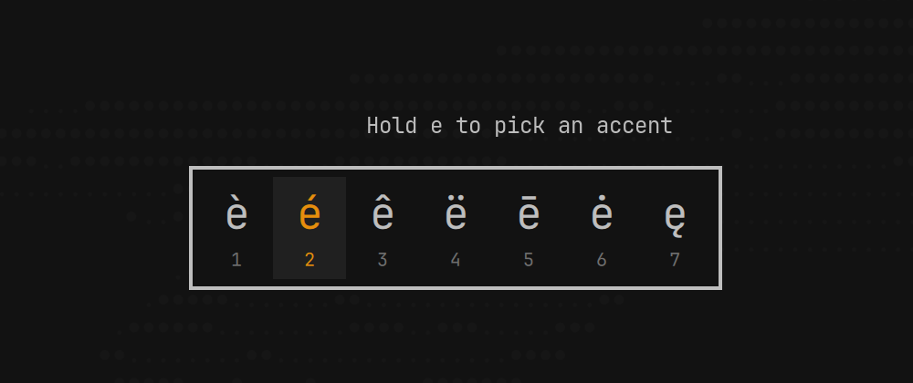

# Accent Hold

macOS-style press and hold for accented characters on [Omarchy](https://omarchy.org).

Hold a letter such as `e`. A small popup shows `è é ê ë ē ė ę`. Press a number, click a variant, or use the arrow keys and Return. The letter you typed is replaced.



## Install

```bash
omarchy plugin add https://github.com/n1c01a5/omarchy-accent-hold --enable
```

The feature is active as soon as the plugin is enabled. No restart and no logout are needed.

## Remove

```bash
omarchy plugin remove io.github.n1c01a5.accent-hold
```

Disabling or removing the plugin removes every Hyprland bind it added. The plugin never edits your configuration files.

## Use

| Action | Result |
|--------|--------|
| Hold a letter with variants | The popup opens |
| `1`–`9`, `0` | Replace the letter with that variant |
| Click a variant | Same |
| `←` `→`, `Tab` `Shift+Tab` | Move the highlight |
| `Return` / `Space` | Confirm the highlight (typed normally if nothing is highlighted) |
| `Esc` or click outside | Close and keep the letter |
| Any other key | Close, keep the letter, and type that key |
| Hold `Shift`, or Caps Lock on | Uppercase variants |

Letters with variants (macOS English set): `a c e i l n o s u y z`. Other letters keep their normal auto-repeat. Letters held with Ctrl, Alt, Super or AltGr never open the popup, so shortcuts such as `SUPER + E` are unchanged.

### Timing

As on macOS, the popup replaces auto-repeat for letters with variants. It opens 60 ms before Hyprland's `input.repeat_delay`, so the application never repeats the letter. For a longer hold, raise `repeat_delay` in `~/.config/hypr/input.lua`. This is the same as "Delay until repeat" on a Mac.

## Configure

Optional: create `~/.config/omarchy/accent-hold.json`. It reloads on save.

```json
{
  "holdDelay": 0,
  "position": "window",
  "excludeClasses": ["^steam_app_"],
  "accents": { "e": "éèêëēėę", "o": "" }
}
```

| Key | Default | Meaning |
|-----|---------|---------|
| `holdDelay` | `0` | Milliseconds before the popup opens. `0` follows `repeat_delay`. It can only shorten the delay. |
| `position` | `"window"` | `"window"` centers the popup on the focused window. `"pointer"` opens it above the mouse pointer. |
| `excludeClasses` | `[]` | [Lua patterns](https://www.lua.org/manual/5.4/manual.html#6.4.1) for window classes where the popup never opens. |
| `accents` | macOS set | Variant strings per letter, in display order. Use `""` to turn a letter off. Uppercase forms are derived automatically. |

Wayland gives other programs no access to the text caret position. For this reason, the popup cannot sit at the caret as it does on macOS.

## How it works

- `hypr/accent-hold.lua` is loaded into Hyprland with `hyprctl eval`. It adds one non-consuming bind per accent letter and watches Hyprland's key events. When a letter stays down for the hold delay, it sends a custom Hyprland IPC event.
- `Service.qml` runs inside `omarchy-shell`. It receives the event, shows the popup with the current Omarchy theme, and types the result with `wtype` (`BackSpace` and then the variant).
- The plugin loads the Lua again after each Hyprland config reload and removes it when the plugin is disabled.

The plugin does not need root or the `input` group, and it never reads `/dev/input`. It only sees the keys that Hyprland's keybind engine already sees.

## Requirements

- Omarchy with the Quickshell-based `omarchy-shell` and Hyprland with Lua config (tested on 0.56.2)
- `wtype` (installed by default on Omarchy)

## Development

```bash
node --test tests/          # unit tests for Accents.js
tests/live.sh               # end-to-end test on a running session (needs foot and ydotool)
```

The behavior is specified in [SPEC.md](SPEC.md).

## License

[MIT](LICENSE)
